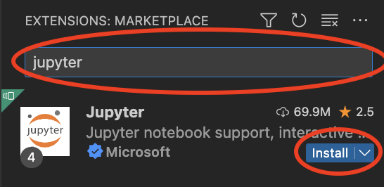

# Connecting to Jupyter Server on VSCode

## Install the Jupyter Extension 

First connect to your VM Instance using the Remote Explorer extension on VS Code. Checkout this guide on further details on how to set this up: [https://www.syntio.net/en/labs-musings/connecting-vscode-using-ssh-to-a-vm-instance-on-gcp/](https://www.syntio.net/en/labs-musings/connecting-vscode-using-ssh-to-a-vm-instance-on-gcp/). Ignore the part about setting up SSH keys as well as adding them to Google Cloud as you already did that in P1. Instead, follow the section on how to update your ssh config file and use that to Remote-SSH. 

Once you have SSHed into the VM instance, install the extension using the Jupyter extension following these steps:
* Click on the Extensions tab
* Search for Jupyter in the search bar
* Install the Jupyter extension

A visual walkthrough is shown below:





## Launching the Jupyter Notebook Server

First define your Dockerfile to download all of your required dependencies as well to support launching a Jupyter server. Let us say that we need the unzip command as well as the pandas and matplotlib Python library, then we can define a Dockerfile something like this: 
```
# Install dependencies
# Install dependencies
FROM ubuntu:22.04
RUN apt-get update; apt-get install -y wget python3-pip
RUN pip3 install jupyterlab==3.4.5 pandas matplotlib

# Launch the Jupyterlab server
CMD ["python3", "-m", "jupyterlab", "--no-browser", "--ip=0.0.0.0", "--port=8080", "--NotebookApp.token=''", "--allow-root"]
```

Then build the Dockerfile using the command `docker build . -t jupyter_server` and then startup the server using the command `docker run -it -d -p 8080:8080 jupyter_server`.

## Connecting the notebook to the server

To test that we can connect the server, create a new `ipynb` and try to import the two libraries using the following code: 
```
import pandas as pd
import matplotlib.pyplot as plt
print("Packages imported sucessfully")
```

To connect to the kernels, follow these steps:
* Click on "Select Kernel"
* Click on "Existing Jupyter Server"
* Click on "Enter the URL of the running Jupyter server". If this is your first time connecting to the server, you might directly taken to this step without needing to click the option.
* Enter in the endpoint `https://localhost:8080`
* Allow for connection over HTTP in the prompt that shows up on the lower right corner
* Select the Python 3 kernel 
* Optionally, enter in a server display name but feel free to leave it blank as well

You should now be able to run the cells in your notebook using the kernel in the docker. A visual walkthrough of this whole process is shown below:


