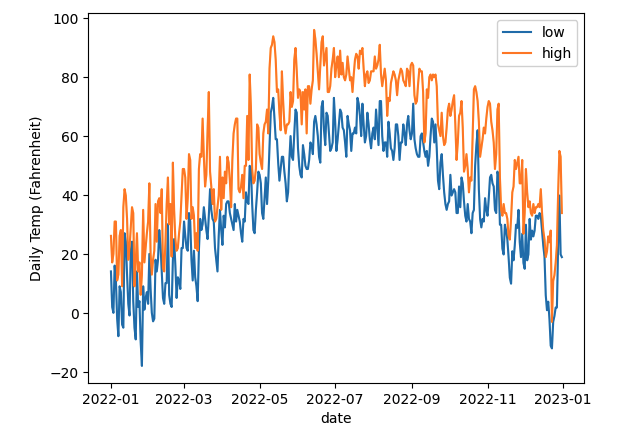

# DRAFT!  Don't start yet.

# P6 (6% of grade): Cassandra, Weather Data

## Overview

NOAA (National Oceanic and Atmospheric Administration) collects
weather data from all over the world.  In this project, you'll explore
how you could (1) store this data in Cassandra, (2) write a server for
data collection, and (3) analyze the collected data via Spark. You can
find the datasets we are going to be using in the `datasets` directory
of `p6`. 

We'll also explore read/write availability tradeoffs.  When always
want sensors to be able to upload data, but it is OK if we cannot
always read the latest stats (we prefer an error over inconsistent
results).

Learning objectives:
* create a schema for a Cassandra table that uses a partition key, cluster key, and static column
* create custom Cassandra types
* create custom Spark UDFs (user defined functions)
* configure queries to tradeoff read/write availability
* refresh a stale cache

Before starting, please review the [general project directions](../projects.md). 
**Important: Please don't remove any comments in the starting code as the autograder uses that to determine
which cells to run and check.**

## Corrections/Clarifications

* updated the container setup page. Mounting cassandra.sh instead of main.sh
* when inserting metatdata to weather station table only insert those stations belongs to Wisconsin only
* Apr 7: vnode token example in Q2 was incorrect -- fixed it
* Apr 10: Q4 calculate the correlation between the maximum temperatures in Madison and Milwaukee
* Apr 11: updated examples to have server.py in "notebooks" (instead of "share")
* Apr 12: added clarification about counts in q7

## Setup

We have provided you a Docker compose file that launches three cassandra nodes. You can start up these nodes by making sure you are in the `p6` direcotry and then running `docker-compose up -d`. Note that you need to wait about 15 to 20 seconds after spinning up the containers before you can connect to the cluster.

Next run `docker ps` which will produce an output like this:
```
CONTAINER ID   IMAGE      COMMAND          CREATED        STATUS        PORTS                      NAMES
7b1ab3156825   p6-image   "sh /start.sh"   39 hours ago   Up 39 hours   127.0.0.1:5001->5000/tcp   p6_db_3
4c4427fcbca4   p6-image   "sh /start.sh"   39 hours ago   Up 39 hours   127.0.0.1:5000->5000/tcp   p6_db_2
bd3b8e3bca56   p6-image   "sh /start.sh"   39 hours ago   Up 39 hours   127.0.0.1:5002->5000/tcp   p6_db_1
```
Note that container `p6_db_2` is using the host port `127.0.0.1:5000`. We are going to be running all of other scripts in this container, and thus will
be calling the `<main_container>` in the rest of the docker specs. Thus, if you see something like `docker inspect <main_container>` then that is equivalent
to `docker inspect p6_db_2` based on the docker ps output.  

Then manually start Jupyter inside the main container using the command:
```
docker exec -it -d <main_container> python3 -m jupyterlab --no-browser --ip=0.0.0.0 --port=5000 --notebook-dir notebooks  --NotebookApp.token='' --allow-root
```
After running this command, you should then be able to open `http://localhost:5000/lab`, find your notebook, and run it.

Note that a `p6.ipynb` containing a starting template has already been provided to you. The starter code specifies all the imports you will likely need to complete this project but feel free add more imports if necessary. Additionally, it sets up a cluster that will connect to the three nodes as well as spark session you can use.

## Part 1: Station Metadata

The first thing you need to do is implement the `setup_cassandra_table` (which has the comment "TODO: Q1") function which should do the following:
* drop a `weather` keyspace if it already exists
* create a `weather` keyspace with 3x replication
* inside `weather`, create a `station_record` type containing two ints: `tmin` and `tmax`
* inside `weather`, create a `stations` table
  * have four columns: `id` (text), `name` (text), `date` (date), `record` (weather.station_record)
  * `id` is a partition key and corresponds to a station's ID (like 'USC00470273')
  * `date` is a cluster key, ascending
  * `name` is a static field (because there is only one name per ID).  Example: 'UW ARBORETUM - MADISON'
  * `record` is a regular field because there will be many records per station partition. Note that since record is a user defined type, you should ensure that is immutable using the `frozen` keyword.

#### Q1: what is the schema?

Next run the cell with the comment "Q1 Ans" which calls `setup_cassandra_table()` function and then executes a couple of queries to verify the schema is as expected. 

### Adding metadata to table

The starter code creates a Spark session for you. Note that we're running Spark in a simple "local mode" -- we're not connecting to a Spark cluster so we won't have multiple workers. Tasks will be executed directly by the driver.

The next we have to do is read the `stations_metadata.csv` file. The starter code alreadys provides you the code to read this file into a Spark table. Note that the table
has the following schema:
```
root
 |-- ID: string (nullable = true)
 |-- LATITUDE: string (nullable = true)
 |-- LONGITUDE: string (nullable = true)
 |-- ELEVATION: string (nullable = true)
 |-- STATE: string (nullable = true)
 |-- NAME: string (nullable = true)
 |-- GSN FLAG: string (nullable = true)
 |-- HCN/CRN FLAG: string (nullable = true)
 |-- WMO ID: string (nullable = true)
``` 

Now use Spark and Cassandra to insert the `ID` and `NAME` metadata of every station in `stations_metadata.csv` that belongs to Wisconsin `WI` (i.e. having a `STATE` of `WI`) into `weather.stations`. Feel free to use `.collect()` on your Spark DataFrame and loop over the results, inserting one by one. Please make sure to verify your Spark DataFrame before inserting metatdata to Casssandra and that you write your code in the cell with the comment "TODO: Code to insert metadata into weather.stations".

You can verify that you performed the above task correctly by running the cell containing the comment "Metadata insert verify" and ensuring that it prints out `1313`.

#### Q2: what is the token of the vnode that comes first after the partition for the USC00470273 sensor?

You will answer this question by implementing the `get_tokens` function (which has the comment "TODO: Q2") which takens in a `station_id` and returns two values:
* `row_token` : The token associated with the given `station_id`. You can use the `token(????)` CQL function in order to calculate this value
* `vnode_token` : The token of the vnode that comes after the partition for the provided `station_id`. You can use [subprocess.run](https://docs.python.org/3/library/subprocess.html#using-the-subprocess-module) to run `nodetool ring`. Then write some code to parse the output, loop over the ring and find the correct vnode. 

Verify your code by running the cell with the comment "Q2 Ans" which should output something like this (numbers may differ):
```
Row token: -9014250178872933741
Vnode token: -8978105931410738024
```

## Part 2: Temperature Data

### Server

Now you'll write gRPC-based server.py file that receives temperature data and records it to `weather.stations`.  You could imagine various
sensor devices acting as clients that make gRPC calls to `server.py` to record data, but for simplicity we'll make the client calls from
`p6.ipynb`. Start by creating the file `server.py` file in the `nb` directory.

In the starter code, we provide with the following proto file in `nb/station.proto`:
```
syntax="proto3";

service Station {
        rpc RecordTemps(RecordTempsRequest) returns (RecordTempsReply) {}
        rpc StationMax(StationMaxRequest) returns (StationMaxReply) {}
}

message RecordTempsRequest {
        string station = 1;
        string date = 2;
        int32 tmin = 3;
        int32 tmax = 4;
}

message RecordTempsReply {
        string error = 1;
}

message StationMaxRequest {
        string station = 1;
}

message StationMaxReply {
        int32 tmax = 1;
        string error = 2;
}
```

We have already built the proto file and also provide you with `station_pb2_grpc.py` and `station_pb2.py` files as well. 

In `server.py`, implement the interface from `station_pb2_grpc.StationServicer`.  RecordTemps will insert new temperature 
highs/lows to `weather.stations`.  `StationMax` will return the maximum `tmax` ever seen for the given station.

Each call should use a prepared statement to insert or access data in `weather.stations`.  It could be something like this:
```python
insert_statement = cass.prepare("????")
insert_statement.consistency_level = ConsistencyLevel.ONE
max_statement = cass.prepare("????")
max_statement.consistency_level = ????
```

Note that W = 1 (`ConsistencyLevel.ONE`) because we prioritize high write availability.  The thought is that real sensors might not have
much space to save old data that hasn't been uploaded, so we want to accept writes whenever possible.

Choose R so that R + W > RF.  We want to avoid a situation where a `StationMax` returns a smaller temperature than one previously added
with `RecordTemps`; it would be better to return an error message if necessary.

If execute of either prepared statement raises a `ValueError` or `cassandra.Unavailable` exception, `server.py` should return a
response with the `error` string set to something informative.

**Important: Your server.py can't make the assumption that stations table or the weather keyspace has already been created. Thus, your
code your should check if the keyspace exists and if not create the keyspace and table following the instructions in Part 1. We recommend
copying your `setup_cassandra_table` implementation and using it in server.py.**

Making sure to save your `server.py`, startup the server by running the command:
```
docker exec -it <main_container> python3 /notebooks/server.py
```

### Client

Once the server is running, we will connect to from our juypter notebook. In Part 2 of the notebook, fill out the cell with the comment
"Connect to the server" to create the client and the stub. 

Then implement the `simulate_sensor` function (having comment "TODO: gRPC client simulation") which takes in a `sensor_id` and then sends
data from that sensor to the server. You can find the temperature data for all of the sensors `/datasets/station_temp_data.csv` and it is a CSV file having
4 columns: [`station_id`, `date`, `type`, `value`]. The `type` field specifies what kinda of data it is: `TMIN` (Min temperature) or `TMAX` (Max temperature). 
Your implementation should ensure that for a given `sensor_id`, it should only record data for days for which we have both the `TMIN` and `TMAX` values. The
function should return the number of dates for which the `stub.RecordTemps` call returned an error. 

To verify your implementation, run the cell having the comment "gRPC client runner" and ensure that produces the following output:
```
max temp for USW00014837 is 356
max temp for USR0000WDDG is 344
max temp for USW00014898 is 356
max temp for USW00014839 is 378
```

## Part 3: Spark Analysis

Next we are going to be configuring our spark session such that we have access to the table in Cassandra. The starter code already includes code to read the table using the session. You can find this code in the cell after the Part 3 header. 

Next implement the function `create_weather_view` (having comment "Initialize the weather2022 view") which should do the following:
* Create a view called `weather2022` that contains all 2022 data from `cassandra.weather.stations`.
* Cache `weather2022`.
* Register a UDF (user-defined function) that takes a TMIN or TMAX number and returns the temperature the Farheneith. Note that the default unit of temperature of a TMIN or TMAX number is tenth of a degree (i.e. if we have a TMAX of `1` that is equivalent to `10 °C`). 

Verify your implementation by running the cell with the comment "Weather2022 verify" and ensuring that it produces the following output:
```
+---------+-----------+-----------+
|namespace|  tableName|isTemporary|
+---------+-----------+-----------+
|         |weather2022|       true|
+---------+-----------+-----------+
```

#### Q3: what were the daily highs and lows at Madison's airport in 2022?

Madison airport has a station id of USW00014837. Using this information, `weather2022` and your UDF generate the following plot:



Write your code in the cell with the comment "TODO: Q3. 


#### Q4: what is the correlation between maximum temperatures in Madison and Milwaukee?

Use station id of USW00014837 for Madison and USW00014839 for Milwauke. Checkout the [coor function](https://spark.apache.org/docs/3.1.1/api/python/reference/api/pyspark.sql.functions.corr.html) provided by pyspark, which has already been imported for you. Write your code in the cell with the comment "TODO: Q4" and ensure that prints out the coorelation rounded to 2 decimal places. The output of running the cell should be something like this (number might be different):
```
Coorelation of 0.21
```

## Part 4: Disaster Strikes

Before starting this part, kill off one of the containers that is **not the `<main_container>`** using `docker kill`. 

#### Q5: does StationMax still work?

Try to get the maximum for station USW00014837 using your gRPC stub. Print out "StationMax returned <some_val> for USW00014837" if StationMax works or "StationMax call for USW00014837 returned error: <error_msg>" if it doesn't. In the previous sentence, <some_val> represents the max temperature returned by gRPC call and <error_msg> represents the error returned by the gRPC call. Write your code in the cell with the comment "TODO: Q5". 

#### Q6: does simulate_sensor still work?

Try to add data for sensor USC00477115 using the `simulate_sensor` function. Record the response of the function call by printing out "Failed to write data for <num_errors> date(s) of USC00477115" where <num_errors> is the value returned by simulate_sensor. Write your code in the cell with the comment "TODO: Q6". 

#### Q7: how does refreshing the stale cache change the number of rows in weather2022?

Print the number of rows in weather2022, refresh the cache, then print the count again. Your output should look like:
```
Before refresh: 1460
After refresh: 1825
```

Note that we're only counting regular rows of data (not per-partition data in partition keys and static columns), so you can use something
`COUNT(record)` to only count rows where record is not NULL. Write your code in the cell with the comment "TODO: Q7"

## Submission

We should be able to run the following on your submission to create the mini cluster:

```
docker-compose up
```

We should be able to start Jupyter and your server like this:

```
docker exec -it -d ???? python3 -m jupyterlab --no-browser --ip=0.0.0.0 --port=5000 --allow-root --NotebookApp.token=''
```

AND

```
docker exec -it ???? python3 /notebooks/server.py
```

We should then be able to open `http://localhost:5000/lab`, find your notebook, and run it.

We also be using an autograder to verify your solution which you can run yourself by running the following command in the `tester` directory:
```
python3 p6_tests.py --dir ../p6
```

If we want to see how the autograder works as well as to see the result produced when running your notebooks, run the command in the `tester` directory. 
```
python3 p6_tests.py --dir ../p6 --verbose --tmp_dir .
```
This will create a `p6` dir in your `tester` directory and you can find the results in `p6/autograder_results`. 

## Approximate Rubric:

The following is approximately how we will grade, but we may make
changes if we overlooked an important part of the specification or did
not consider a common mistake.

1. [x/1] question 1 (part 1)
2. [x/1] question 2 (part 1)
3. [x/1] **server** (part 2)
4. [x/1] **client** (part 2)
5. [x/1] **view/caching/UDF** (part 3)
6. [x/1] question 3 (part 3)
7. [x/1] question 4 (part 3)
8. [x/1] question 5 (part 4)
9. [x/1] question 6 (part 4)
10. [x/1] question 7 (part 4)
