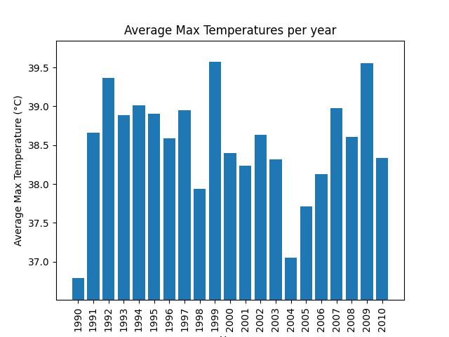

# DRAFT!  Don't start yet.

# P7 (6% of grade): Kafka, Weather Data

## Overview

For this project, imagine a scenario where you are receiving daily
weather data for a given location. Your task is to populate this data
into a Kafka stream using a *producer* Python program. A *consumer*
Python program consumes data from the stream to produce JSON files
with summary stats, for use on a web dashboard (you don't need to
build the dashboard yourself). Later in the project, the consumer
itself acts as a producer to populate certain messages into another
Kafka topic. Finally, you will visualize some of the data collected by
the consumer.

For simplicity, we use a single Kafka broker instead of using a
cluster.  A single producer will generate weather data in an infinite
loop at an accelerated rate (1 day per 0.5 second). Finally, consumers
will be different processes, launching from the same Python program.

Learning objectives:
* write code for Kafka producers
* write code for Kafka consumers
* apply streaming techniques to achive "exactly once" semantics
* write to different Kafka topics
* use manual and automatic assignment of Kafka topics and partitions
* ensure atomic writes to files

Before starting, please review the [general project directions](../projects.md).

## Clarifications/Correction
* none yet

## Container setup

Start by creating a `files` directory in your repository. Your Python programs and generated files must be stored in this directory.
Next, build a `p7` docker image with Kafka installed using the provided Dockerfile.
Run the Kafka broker in the background using:

```
docker run -d -v ./files:/files --name=p7 p7
```

You'll be creating three programs, `producer.py`, `debug.py`, and
`consumer.py`.  You can launch these in the container like this:
`docker exec -it p7 python3 /files/<path_of_program>`.  This will run
the program in the foreground, making it easier to debug.

All the programs you write for this projects will run forever, or
until manually killed.

## Part 1: Kafka Producer

### Topic Initialization

Create a `files/producer.py` that creates a `temperatures` topic with 4
partitions and 1 replica.  If the topic already existed, it should
first be deleted.

Feel free to use/adapt the following:

```python
from kafka import KafkaAdminClient
from kafka.admin import NewTopic
from kafka.errors import UnknownTopicOrPartitionError

broker = 'localhost:9092'
admin_client = KafkaAdminClient(bootstrap_servers=[broker])

try:
    admin_client.delete_topics(["temperatures"])
    print("Deleted topics successfully")
except UnknownTopicOrPartitionError:
    print("Cannot delete topic/s (may not exist yet)")

time.sleep(3) # Deletion sometimes takes a while to reflect

temperatures_topic = NewTopic(name="temperatures", num_partitions=4, replication_factor=1)
admin_client.create_topics([temperatures_topic])

print("Topics:", admin_client.list_topics())
```

### Weather Generation

Using the provided `weather.py` file, you can infinitely generate
daily weather data starting from 1990-01-01 for a specific location
(loosely modelled around weather of Dane County). Copy `weather.py` to
your `files` directory and try generating some data using the
ufollowing code snippet. This will generate the weather at an
accelarated rate of 1 day per 0.5 second:

```python
import weather

# Runs infinitely because the weather never ends
for date, degrees in weather.get_next_weather(delay_sec=0.5):
    print(date, degrees) # date, max_temperature
```

Note: The above snippet is just for testing, don't include it in your submission.

Instead of printing the weather, create a KafkaProducer to send the
reports to the `temperatures` topic.

For the value format, use protobufs.  To start, create a protobuf file
`report.proto` in `files` with a `Report` message having the following
entries, and build it to get a `???_pb2.py` file (review P3 for how to
do this if necessary):

* string **date** (format "YYYY-MM-DD") - Date of the observation
* double **degrees**: Observed max-temperature on this date

### Requirements
1. Use a setting so that the producer retries up to 10 times when `send` requests fail
2. Use a setting so that the producer's `send` calls are not acknowledged until all in-sync replicas have received the data
3. When publishing to the `temperatures` stream, use the string representation of the month ('January', 'February', ...) as the message's `key`
4. Use a `.SerializeToString()` call to convert a protobuf object to bytes (not a string, despite the name)

### Running in Background

When your producer is finished, consider running it in the background indefinitely:

```
docker exec -d p7 python3 /files/producer.py
```

## Part 2: Kafka Debug Consumer

Create a `files/debug.py` program that initializes a KafkaConsumer.  It
could be in a consumer group named "debug".

The consumer should subscribe to the "temperatures" topic; let the
broker automatically assign the partitions.

The consumer should NOT seek to the beginning.  The consumer should
loop over messages forever, printing dictionaries corresponding to
each message, like the following:

```
...
{'partition': 2, 'key': 'December', 'date': '2000-12-26', 'degrees': 31.5235}
{'partition': 2, 'key': 'December', 'date': '2000-12-27', 'degrees': 35.5621}
{'partition': 2, 'key': 'December', 'date': '2000-12-28', 'degrees': 4.6093}
{'partition': 2, 'key': 'December', 'date': '2000-12-29', 'degrees': 26.3698}
{'partition': 2, 'key': 'December', 'date': '2000-12-30', 'degrees': 41.9125}
{'partition': 2, 'key': 'December', 'date': '2000-12-31', 'degrees': 46.1511}
{'partition': 2, 'key': 'January', 'date': '2001-01-01', 'degrees': 40.391}
...
```

Use your `debug.py` to verify your producer is writing to the stream
as expected.

## Part 3: Kafka Stats Consumer

Now you'll write a `files/consumer.py` that computes stats on the
`temperatures` topic, outputing results to JSON files after each
batch.

### Partition Files

`consumer.py` will use manual partition assignment.  If it is launched
as `docker exec -it p7 python3 /files/consumer.py 0 2`, it should
assign partitions 0 and 2 of the `temperatures` topic.

Overview:
* there are 12 months but only 4 partitions, so naturally some partitions will correspond to data from multiple months
* each partition will correspond to one JSON file named `partition-N.json` (where N is the partition number), so there will be 4 JSON files
* we might launch fewer than 4 consumer.py processes, so each process should be capable of keeping multiple JSON files updated

When a consumer launches that is responsible for partition N, it
should check whether `partition-N.json` exists.  If it does not exist,
your consumer should first initialize it to `{"partition": N,
"offset": 0}`.

Your consumer should then load `partition-N.json` to a Python
dictionary.  To manage each partition in memory, you might want a
another dictionary where each key is a partition number and each value
is a dictionary with data for that partition.

When the `partition-N.json` files are loaded, your consumer should
`seek` on each partition to the offset specified in the file.

### Offset Checkpointing

Your consumer should have an infinite loop that keeps requesting
messages batches for each assigned partitition.

After processing the messages in a partition of a batch, your consumer
should check the current offset on the partition, use that to update
the "offset" field in the partition dictionary, and write the
partition out to the appropriate `partition-N.json` file.

### Atomic Writes

Remember that we're producing the JSON files so somebody else (not
you) can use them to build a web dashboard. We will also use the JSON
files to continously plot graphs. What if the dashboard app reads
the JSON file at the same time your consumer is updating the file?
It's possible the dashboard or plotting app could read an
incomprehensible mix of old and new data.

To prevent such partial writes, the proper technique is to write
a new version of the data to a different file.  For example, say the
original file is `F.txt` -- you might write the new version to
`F.txt.tmp`.  After the new data has been completely written, you can
rename F.txt.tmp to F.txt.  This atomically replaces the file
contents. Anybody trying to read it will see all old data or all new
data.  Here is an example:

```python
path = ????
path2 = path + ".tmp"
with open(path2, "w") as f:
    # TODO: write the data
    os.rename(path2, path)
```

Be sure to write your JSON files atomically.

Note that this only provides atomicity when the system doesn't crash.
If the computer crashes and restarts, it's possible some of the writes
for the new file might only have been buffered in memory, not yet
written to the storage device.  Feel free to read about `fsync` if
you're curious about this scenario.

### Statistics

In addition to recording `partition` and `offset`, each
`partition-N.json` file should have a key for each month seen in that
partition; the corresponding value should be a dictionary with years
as keys.  Each year will correspond to yet another dictionary with
stats about that month/year combination.

Following is an example of a JSON file corresponding to partition 2
(due to several factors you'll probably never see this exact data):


```json
{
  "partition": 2,
  "offset": 4117,

  "January": {
    "1990": {
      "count": 31,
      "sum": 599,
      "avg": 19.322580645161292,
      "end": "1990-01-31",
      "start": "1990-01-01"
    },
    "1991": {
      "count": 31,
      "sum": 178,
      "avg": 5.741935483870968,
      "end": "1991-01-31",
      "start": "1991-01-01"
    }
  },

  "April": {
    "1990": {
      "count": 30,
      "sum": 1113,
      "avg": 37.1,
      "end": "1990-04-30",
      "start": "1990-04-01"
    },
    "1991": {
      "count": 30,
      "sum": 1149,
      "avg": 38.3,
      "end": "1991-04-30",
      "start": "1991-04-01"
    }
  }
}
```

That stats for each month/year combination should include:

* `count`: the number of days for which data is available.
* `sum`: sum of temperatures seen so far (yes, this is an odd metric by itself)
* `avg`: the `sum/count`. This is the only reason we record the sum - so we can recompute the average on a running basis without having to remember and loop over all temperatures each time the file is updated
* `start`: the date of the *first* measurement for the corresponding
month and year combination
* `end`: the date of the *last* measurement for the corresponding
month and year combination

In the sample JSON, under "January" for the year "1990", the count is
31 (indicating data for all 31 days of January was recorded), the sum
is 599, the avg is approximately 19.32, and the data collection period
is from "1990-01-01" to "1990-01-31". This pattern repeats for each
month and year combination in the dataset.

Your consumer should suppress duplicate dates when computing these
stats; it can recognize this when a date is <= the previous date
seen.

### Exactly-Once Semantics (Recap)

Unless the producer repeatedly fails to write a message, each
message/measurement should be counted exactly once in the output
stats.  We have alreading been providing directions on how to achieve
this, but we repeat the details here for review.

To avoid **undercounting**:
* the producer must use an ackowledgement option so that `send` is not considered successful until all in-sync replicas have received the data
* the producer must use an option to retry up to 10 times upon failure to receive such an ack

To avoid **overcounting**:
* when a consumer updates a JSON file, it must record the current read offset in the file (you can get this with `consumer.position(???)`)
* when a new consumer starts, it must start reading from the last offset (you can do this with `consumer.seek(????)`)
* when a consumer reads a message, it should ignore it if the date is <= the previous date processed (the `end` entry in the station dict will help with this).  Remember that producers retry when they don't get an ack, but it's possible for an ack to be lost after a successful write. So retry could produce duplicates in the stream. To highlight this, the weather generation function has a 5% chance of generating a duplicated value, so keep this in mind. Other than these duplicated entries, you may assume all other messages are generated in order.

## Part 4: Visualizing Yearly Trends

In this part, we will visualize the weather summary, for a given month, stored in the partition json files. Read the partition files to identify which file contains weather data for the month of **January**. For this month, plot a bar chart with its x-axis representing the years over which weather summary data exists. The y-axis should represent the average temperature for each year in January. Save the graph in the `files` directory under the name `yearly_trend.png`

Since data is continuously being produced in the background, your plot will keep getting outdated and will need refreshing. Use the below structure to re-generate the plot every 30 seconds to reflect the updated data in the generated png:

```python
target_month = "January"
# TODO: Find path of partition file storing summary for January
partition_file_with_tgt = ???

fig, ax = plt.subplots()
# Keep refreshing the plot after 5 seconds
while True:
    time.sleep(5)

    try:
      # TODO: Read January's yearly temperatures from 'partition_file_with_tgt'
    except Exception as e:
      print("Failed reading partition for January, retrying...")
      continue    

    # Clear the previous plot data
    ax.clear()
    # Update the plot with new data
    ax.bar(x, y)
    ax.set_xlabel('Year')
    ax.set_ylabel('Avg. Max Temperature for January')
    ax.set_title('Avg. Max Temperatures per year')
    plt.xticks(rotation=90)

    # Save the plot
    plt.savefig('/files/yearly_trends.png')
    print("Refreshed Graph")
```



### Atomic File Writes

TODO

## Submission
All your code and generated files (partition json files and graphs) should be in a directory named `files` within your repository.
Your generated files (partition JSON files, graph, birthday JSON file) must contain data for atleast 3 years starting from 1990.

We should be able to run the following on your submission to build and run the required image:

```
# To build the image
docker build . -t p7

# To run the kafka broker
docker run -d -v ./files:/files p7

# To run the producer program
docker exec -it <container_name> python3 /files/producer.py
# To run the consumer program
docker exec -it <container_name> python3 /files/consumer.py
```

Verify that your submission repo has a structure similar to this:

```
.
├── Dockerfile
└── files
    ├── producer.py
    ├── consumer.py
    ├── report.proto
    ├── partition-0.json
    ├── partition-1.json
    ├── partition-2.json
    ├── partition-3.json
    ├── yearly_trends.png
    ├── birthday.json
    ├── report_pb2.ipynb
    └── weather.py
```

# Testing
We will be using an autograder to verify your solution which you can run yourself by running the following command in the p7 directory:

```
python3 autograde.py
```